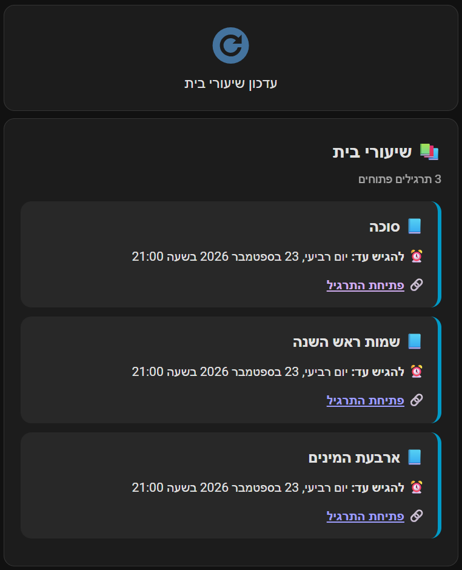

# Galim Pro MQTT Monitor

Unofficial monitor that signs in to Galim Pro, reads active homework from the
Galim LMS API, and publishes it to Home Assistant through MQTT Discovery.

> This project is not affiliated with Galim or the Israeli Ministry of
> Education. Use it only with an account you are authorized to access.

This project was developed by Yaron Kofman in collaboration with ChatGPT
(OpenAI), using OpenAI models for design, implementation, testing, and
documentation.

## Status

The login and `/personal_api/tasks` request have been verified with a real
account and a live homework payload. Safe field mapping is working, including
lesson names, subjects, due dates, and links. The MQTT entities and the Hebrew
right-to-left Home Assistant dashboard card have also been tested in a live
Home Assistant installation.

## Home Assistant entities

MQTT Discovery creates:

- `sensor.galim_pro_homework`: number of active tasks
- Attributes: normalized task list, total count, and last update time
- `button.galim_pro_check_homework`: request an immediate homework check
- `sensor.galim_pro_last_homework_check`: timezone-aware completion timestamp for
  every manual or scheduled check. Its attributes report the source, whether the
  check succeeded, task and new-task counts, and a generic safe error summary on
  failure.
- `sensor.galim_pro_next_homework_check`: timezone-aware timestamp of the next
  configured scheduled check. It is published at startup and advanced after a
  scheduled check; pressing the manual-check button does not change it.

New tasks are also emitted as non-retained JSON on `galim_pro/homework/new`.

### Recommended Hebrew dashboard card

The integration publishes normalized task data as attributes. For a readable
right-to-left Hebrew card with formatted due dates, copy
[`examples/galim_homework_dashboard.yaml`](examples/galim_homework_dashboard.yaml)
into a Lovelace dashboard. The example also includes the existing manual
refresh button and sorts assignments by due date.

#### Dashboard preview



## Requirements

- Docker with Docker Compose
- A Home Assistant MQTT broker, typically the Mosquitto broker add-on
- Galim Pro access through a Ministry of Education account

### Home Assistant dashboard prerequisites

The MQTT entities work without any frontend add-ons. The example Hebrew card
requires these HACS frontend cards:

1. Install **Config Template Card** (`custom:config-template-card`).
2. Install **HTML Card** (`custom:html-card`).
3. Add the resources supplied by HACS as Lovelace resources (or enable HACS
   automatic resource loading), then reload the browser.

Card-mod is not required by the example card. If the generated entity ID in an
existing dashboard differs, check **Developer Tools → States** and replace
`sensor.galim_pro_galim_pro_homework` in the example; the MQTT Discovery
unique ID and existing button behavior remain unchanged.

## Setup

1. Configure Home Assistant's MQTT integration and broker.
2. Copy the example environment file:

   ```bash
   cp .env.example .env
   ```

3. Edit `.env` locally and set the Galim and MQTT values. Never commit it.
4. Build and start the monitor:

   ```bash
   docker compose up -d --build
   ```

5. Follow startup logs:

   ```bash
   docker compose logs -f galim-pro-monitor
   ```

The sensor should appear automatically after the first successful MQTT
connection and poll.

After installation, use the **עדכון שיעורי בית** button in the example card
for an immediate manual check. The card updates when the retained MQTT state
and attributes are published.

## Session handling

Playwright performs the Ministry login and stores browser state in
`data/browser_state.json`. Later starts try that session before logging in
again. When the API reports an expired session, the monitor removes the stale
state and authenticates again.

The `data/` directory contains bearer cookies and is Git-ignored. Treat it as
sensitive. The monitor never logs credentials or the LMS `SID` cookie.

## Configuration

| Variable | Required | Default | Purpose |
| --- | --- | --- | --- |
| `GALIM_USERNAME` | yes | — | Ministry login username |
| `GALIM_PASSWORD` | yes | — | Ministry login password |
| `MQTT_HOST` | yes | — | MQTT broker hostname or address |
| `MQTT_PORT` | no | `1883` | MQTT broker port |
| `MQTT_USERNAME` | no | — | MQTT username |
| `MQTT_PASSWORD` | no | — | MQTT password |
| `TZ` | no | `Asia/Jerusalem` | Timezone used by the schedule |
| `SCHEDULES` | no | `13:00,15:00,19:00` | Comma-separated daily poll times |
| `SEED_QUIETLY` | no | `true` | Suppress new-task event on first poll |
| `HEADLESS` | no | `true` | Run Chromium without a visible window |
| `DATA_DIR` | no | `/app/data` | Persistent private state directory |
| `LOG_LEVEL` | no | `INFO` | Python logging level |

## Local development

```bash
python -m venv .venv
. .venv/bin/activate
pip install -r requirements-dev.txt
playwright install chromium
pytest -q
ruff check .
```

## Security

- Do not commit `.env`, `config.json`, browser state, cookies, screenshots, or
  captured API payloads containing student information.
- Use a dedicated MQTT account where possible.
- Keep MQTT on the local network or enable transport security.
- Review task attributes before sharing diagnostics.

## License

MIT
